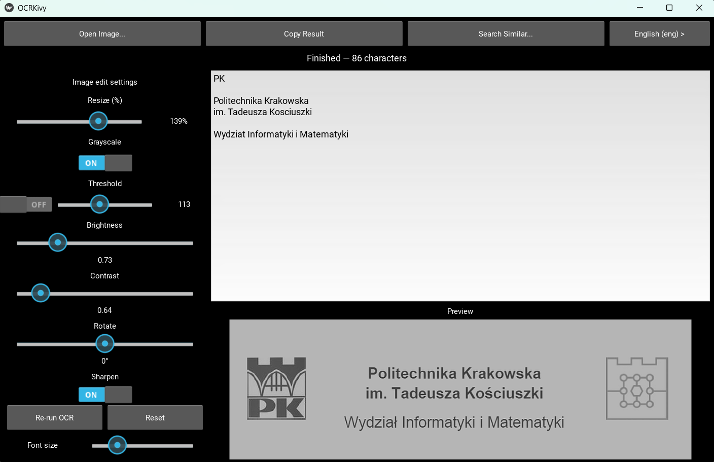

# Windows OCR App (Python, pytesseract)

This is a small Windows (desktop) OCR application implemented in Python using
Kivy, Pillow and pytesseract. The app opens an image file, runs Tesseract
OCR and displays the recognized text. The user can choose OCR language
between English and Polish.

Prerequisites
- Install Tesseract for Windows (UB‑Mannheim builds). Make sure the Tesseract
  executables and traineddata for the languages you need (eng, pol) are installed.
  UB‑Mannheim Windows builds: https://github.com/UB-Mannheim/tesseract/wiki
 - Python 3.8+ and pip.

Install dependencies

```bash
pip install -r requirements.txt
```

Run

```bash
python ocr_app.py
```

## Image preprocessing (GUI options)

The application provides a set of preprocessing controls in the left panel that
let you modify the image before OCR. These options are intended to improve
recognition quality for different kinds of input (scans, photos, low-contrast
prints, handwriting, etc.).

Available preprocessing options
- **Resize (%)** — scale the image (25%–200%). Use a larger percentage to
  increase the effective resolution for small or low-resolution text (try 150%).
  Reducing the size can help on very large images to reduce noise and speed up
  processing.
- **Grayscale** — convert the image to grayscale. This reduces color noise and
  often improves OCR for printed documents.
- **Threshold** — enable the checkbox to apply a binary threshold to the
  grayscale image and use the **Threshold** slider (0–255) to control the
  cutoff. Useful for high-contrast scans where text is darker than the
  background.
- **Brightness** — adjust image brightness (0.5–1.5). Increase for dark scans,
  decrease for overexposed images.
- **Contrast** — adjust image contrast (0.5–1.5). Increasing contrast may help
  separate text from background noise.
- **Rotate (°)** — rotate the image in degrees (−180 to 180). Use this when
  the scan/photo is skewed or rotated.
- **Sharpen** — enable/disable a small sharpen filter that is applied after
  other preprocessing steps. Sharpening can improve OCR on slightly blurred
  scans; disable if it increases noise on photographic images.

Behavior notes
- When an image is opened, the app runs OCR and shows the recognized text and a
  preview of the original image.
- The **Re-run OCR** button runs OCR on the original image using the current
  set of preprocessing controls (it does not permanently modify the original
  file). This lets you quickly try different combinations of settings without
  changing the source file.
- The **Reset** button restores all preprocessing controls to their default
  values and reloads the original image preview and OCR result.

Implementation details
- Preprocessing is implemented with Pillow (PIL). The pipeline applies resize,
  optional grayscale/threshold, optional rotation, brightness and contrast
  adjustments, and an optional sharpen filter.
- If preprocessing fails for any reason the app falls back to the original
  image and logs the error to stderr.

Tips
- Try **Resize = 150%** + **Grayscale** for small printed text.
- Use **Threshold** only when the document background is relatively uniform.




## Build a single EXE (optional)

```bash
pyinstaller --onefile --windowed ocr_app.py
```
The generated executable will be in `dist/ocr_app.exe`.

Notes
- The app attempts to set `pytesseract.pytesseract.tesseract_cmd` to the
  default UB‑Mannheim install location (`C:\Program Files\Tesseract-OCR\tesseract.exe`)
  if it exists. If your Tesseract is installed somewhere else, either add it
  to PATH or set `pytesseract.pytesseract.tesseract_cmd` before running.
- Ensure the required language traineddata (e.g. `eng.traineddata`, `pol.traineddata`)
  are present in Tesseract's `tessdata` folder for the language selector to work.

References
- Tesseract (UB‑Mannheim builds): https://github.com/UB-Mannheim/tesseract/wiki
- pytesseract: https://github.com/madmaze/pytesseract/tree/master

## Bundling Tesseract with the EXE (optional)

If you want to produce a single EXE that contains Tesseract (so it runs on a
machine without Tesseract installed), copy the required Tesseract files into
your project and instruct PyInstaller to include them.

1) Copy Tesseract files
- From your machine (e.g. `C:\Program Files\Tesseract-OCR\`) copy:
  - `tesseract.exe`
  - All required DLLs (files with `.dll`) from the installation folder
  - The `tessdata` folder (contains `eng.traineddata`, `pol.traineddata`, etc.)

  Place them in your project, for example `project_root/tesseract_bundle/`.

2) PyInstaller command

```bash
pyinstaller --onefile --windowed \
  --add-binary "tesseract_bundle/tesseract.exe;." \
  --add-binary "tesseract_bundle/*.dll;." \
  --add-data "tesseract_bundle/tessdata;./tessdata" \
  ocr_app.py
```

Notes on the command:
- `--add-binary "SRC;DEST"` bundles binaries and DLLs; `DEST` is relative inside the bundle.
- `--add-data "SRC;DEST"` bundles non-binary data (like `tessdata`). On Windows use `;` separator.
- After building, PyInstaller extracts bundled files at runtime to `sys._MEIPASS`. The
  application sets `pytesseract.pytesseract.tesseract_cmd` automatically when a bundled
  `tesseract.exe` is detected, and sets `TESSDATA_PREFIX` to the bundled `tessdata`.

3) Common pitfalls
- The `tessdata` folder can be large — expect a bigger executable. Consider packaging
  only the languages you need to reduce size.
- You must include all DLL dependencies of `tesseract.exe`; missing DLLs will cause
  the executable to fail at runtime. If the EXE fails, run `Dependency Walker`
  or check the Tesseract install folder for DLLs to include.
- Testing: Always test the generated EXE on a clean Windows VM to ensure it runs
  without a system Tesseract installed.
Automatic bundling script

-------------------------
A helper script is provided to copy required Tesseract files into the project
so you can build a standalone EXE without installing Tesseract on the target machine.

Usage:

```bash
python scripts/bundle_tesseract.py --source "C:\Program Files\Tesseract-OCR" --dest tesseract_bundle
```

Options:
- `--dry-run` — list actions without copying files.
- `--source` — path to your Tesseract installation (default: `C:\Program Files\Tesseract-OCR`).
- `--dest` — destination folder inside the project (default: `tesseract_bundle`).

What the script copies:
- `tesseract.exe`
- All `.dll` files from the installation folder
- The entire `tessdata` directory (contains language traineddata)

After copying the script prints a recommended `pyinstaller` command that includes
the copied binaries and `tessdata`. Use that command to build the standalone EXE.

Example generated PyInstaller command (script will print exact command for copied files):

```bash
pyinstaller --onefile --windowed \
  --add-binary "tesseract_bundle/tesseract.exe;." \
  --add-binary "tesseract_bundle/<each-dll>.dll;." \
  --add-data "tesseract_bundle/tessdata;./tessdata" \
  ocr_app.py
```

Notes:
- The `tessdata` folder can be large. To reduce size, include only required languages.
- Ensure all required DLLs are copied; missing DLLs will break the bundled executable.

## PowerShell and command-line notes

- The bundling script can also generate helper build scripts for different shells:
  - `--shell powershell` will produce a PowerShell-friendly pyinstaller command (uses backtick ` for line continuation).
  - `--shell bash` produces a bash-friendly multiline command.
  - `--shell cmd` prints a single-line command suitable for cmd.exe.

- Example: generate and write a PowerShell helper script

```bash
python scripts/bundle_tesseract.py --source "C:\Program Files\Tesseract-OCR" --dest tesseract_bundle --write-script build_tesseract_pwsh.ps1 --shell powershell
```

## Testing the bundled EXE

- After building, test the EXE on a clean Windows machine (no Tesseract installed) to ensure all DLLs and `tessdata` were included correctly.
- If the EXE fails to start, inspect the error and verify you included all DLLs from the Tesseract install folder (the script copies DLLs automatically). Tools like Dependency Walker can help identify missing native dependencies.

## Search images by OCR text

This application includes a "Search Similar..." feature accessible from the top bar.
It lets you search a folder of images for those whose recognized text is most similar to a
typed query using TF‑IDF vectors and cosine similarity.

How to use
- Click "Search Similar..." and choose a folder containing image files.
- Enter your query when prompted.
- The app will OCR each image (or use cached OCR results stored as `.ocr_cache.json`
  inside the selected folder), compute TF‑IDF vectors over the recognized texts and rank
  the images by cosine similarity to your query.
- A "Search Results" window opens: the left column shows `path — score` (score is cosine
  similarity); selecting an entry shows the image preview and the OCR text on the right.

Notes and troubleshooting
- If the selected folder contains only empty OCR results, you'll see a message:
  "No OCR text found in the selected folder. Check OCR language/preprocessing."
- Delete `.ocr_cache.json` in the folder to force re-OCRing.
- The app automatically selects and previews the top result after search completes.

- If using NLTK lemmatization, download WordNet data:

```bash
python -c "import nltk; nltk.download('wordnet')"
```

Implementation notes
- The code prefers `spaCy` lemmatization if models are available, falls back to NLTK,
  and finally to a simple regex tokenizer if neither library is present.